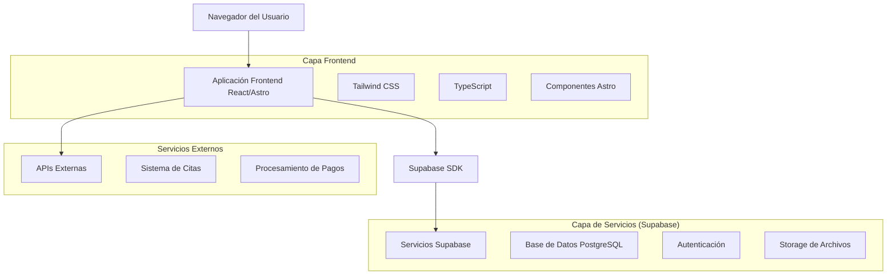
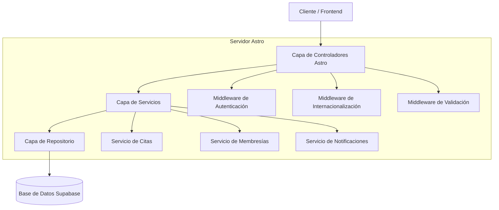
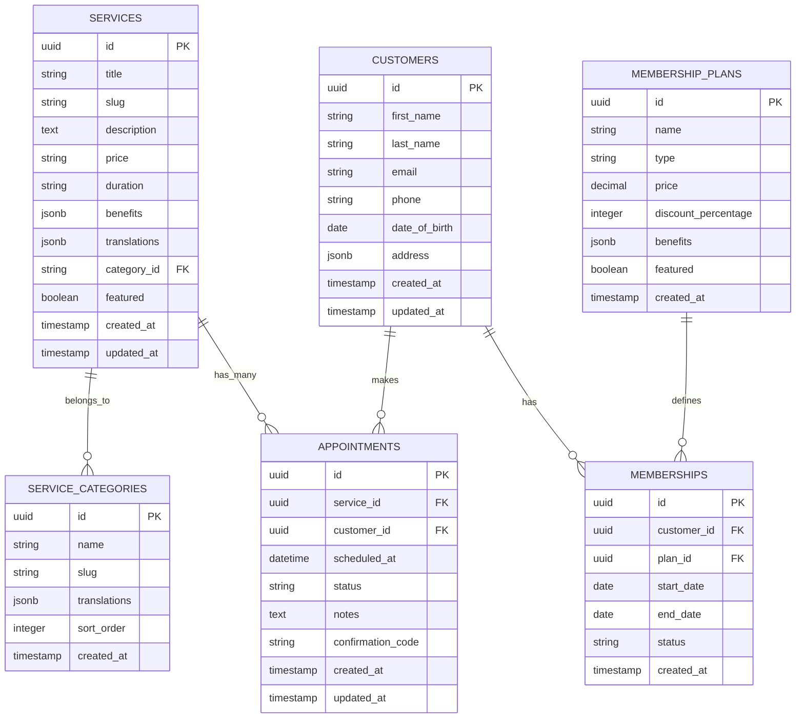

# Documento de Arquitectura Técnica - Renasci Medical Spa

## 1. Diseño de Arquitectura



## 2. Descripción de Tecnologías

- **Frontend**: Astro@4 + React@18 + TypeScript + Tailwind CSS@3
- **Backend**: Supabase (PostgreSQL + Auth + Storage)
- **Herramientas de Build**: Vite + PostCSS
- **Optimización**: Sharp para imágenes, Workbox para PWA

## 3. Definiciones de Rutas

| Ruta | Propósito |
|------|-----------|
| `/` | Página de inicio con hero, servicios destacados y membresías |
| `/es` | Versión en español de la página de inicio |
| `/en` | Versión en inglés de la página de inicio |
| `/es/servicios` | Catálogo completo de servicios en español |
| `/en/services` | Catálogo completo de servicios en inglés |
| `/es/servicios/[categoria]` | Servicios filtrados por categoría en español |
| `/en/services/[category]` | Servicios filtrados por categoría en inglés |
| `/es/servicios/[categoria]/[servicio]` | Detalle de servicio específico en español |
| `/en/services/[category]/[service]` | Detalle de servicio específico en inglés |
| `/es/membresias` | Página de planes de membresía en español |
| `/en/membership` | Página de planes de membresía en inglés |
| `/es/agendar` | Formulario de agendamiento de citas en español |
| `/en/book` | Formulario de agendamiento de citas en inglés |

## 4. Definiciones de API

### 4.1 API Principal

**Gestión de Servicios**
```
GET /api/services
```

Request:
| Nombre Parámetro | Tipo Parámetro | Requerido | Descripción |
|------------------|----------------|-----------|-------------|
| lang | string | false | Idioma (es/en) |
| category | string | false | Filtro por categoría |
| limit | number | false | Límite de resultados |

Response:
| Nombre Parámetro | Tipo Parámetro | Descripción |
|------------------|----------------|-------------|
| services | Service[] | Array de servicios |
| total | number | Total de servicios |
| categories | Category[] | Categorías disponibles |

**Agendamiento de Citas**
```
POST /api/appointments
```

Request:
| Nombre Parámetro | Tipo Parámetro | Requerido | Descripción |
|------------------|----------------|-----------|-------------|
| serviceId | string | true | ID del servicio |
| customerName | string | true | Nombre del cliente |
| customerEmail | string | true | Email del cliente |
| customerPhone | string | true | Teléfono del cliente |
| preferredDate | string | true | Fecha preferida (ISO) |
| preferredTime | string | true | Hora preferida |
| notes | string | false | Notas adicionales |

Response:
| Nombre Parámetro | Tipo Parámetro | Descripción |
|------------------|----------------|-------------|
| success | boolean | Estado de la operación |
| appointmentId | string | ID de la cita creada |
| confirmationCode | string | Código de confirmación |

**Registro de Membresía**
```
POST /api/membership
```

Request:
| Nombre Parámetro | Tipo Parámetro | Requerido | Descripción |
|------------------|----------------|-----------|-------------|
| planType | string | true | Tipo de plan (rack/glow/elite) |
| customerInfo | CustomerInfo | true | Información del cliente |
| paymentMethod | PaymentMethod | true | Método de pago |

Response:
| Nombre Parámetro | Tipo Parámetro | Descripción |
|------------------|----------------|-------------|
| success | boolean | Estado del registro |
| memberId | string | ID de membresía |
| activationDate | string | Fecha de activación |

### 4.2 Tipos TypeScript

```typescript
interface Service {
  id: string;
  title: string;
  slug: string;
  category: string;
  price: string;
  description: string;
  benefits: string[];
  duration: string;
  images: string[];
  featured: boolean;
  translations: {
    es: ServiceTranslation;
    en: ServiceTranslation;
  };
}

interface ServiceTranslation {
  title: string;
  description: string;
  benefits: string[];
  shortDescription: string;
}

interface Category {
  id: string;
  name: string;
  slug: string;
  serviceCount: number;
  translations: {
    es: { name: string };
    en: { name: string };
  };
}

interface MembershipPlan {
  id: string;
  name: string;
  type: 'rack' | 'glow' | 'elite';
  price: number;
  benefits: string[];
  featured: boolean;
  discount: number;
}

interface CustomerInfo {
  firstName: string;
  lastName: string;
  email: string;
  phone: string;
  dateOfBirth: string;
  address: Address;
}

interface Address {
  street: string;
  city: string;
  state: string;
  zipCode: string;
  country: string;
}
```

## 5. Diagrama de Arquitectura del Servidor



## 6. Modelo de Datos

### 6.1 Definición del Modelo de Datos



### 6.2 Lenguaje de Definición de Datos (DDL)

**Tabla de Categorías de Servicios**
```sql
-- Crear tabla de categorías
CREATE TABLE service_categories (
    id UUID PRIMARY KEY DEFAULT gen_random_uuid(),
    name VARCHAR(100) NOT NULL,
    slug VARCHAR(100) UNIQUE NOT NULL,
    translations JSONB NOT NULL DEFAULT '{}',
    sort_order INTEGER DEFAULT 0,
    created_at TIMESTAMP WITH TIME ZONE DEFAULT NOW()
);

-- Índices
CREATE INDEX idx_service_categories_slug ON service_categories(slug);
CREATE INDEX idx_service_categories_sort ON service_categories(sort_order);

-- Permisos Supabase
GRANT SELECT ON service_categories TO anon;
GRANT ALL PRIVILEGES ON service_categories TO authenticated;
```

**Tabla de Servicios**
```sql
-- Crear tabla de servicios
CREATE TABLE services (
    id UUID PRIMARY KEY DEFAULT gen_random_uuid(),
    title VARCHAR(200) NOT NULL,
    slug VARCHAR(200) UNIQUE NOT NULL,
    description TEXT,
    price VARCHAR(50),
    duration VARCHAR(50),
    benefits JSONB DEFAULT '[]',
    translations JSONB NOT NULL DEFAULT '{}',
    category_id UUID REFERENCES service_categories(id),
    featured BOOLEAN DEFAULT false,
    images JSONB DEFAULT '[]',
    created_at TIMESTAMP WITH TIME ZONE DEFAULT NOW(),
    updated_at TIMESTAMP WITH TIME ZONE DEFAULT NOW()
);

-- Índices
CREATE INDEX idx_services_slug ON services(slug);
CREATE INDEX idx_services_category ON services(category_id);
CREATE INDEX idx_services_featured ON services(featured);

-- Permisos Supabase
GRANT SELECT ON services TO anon;
GRANT ALL PRIVILEGES ON services TO authenticated;
```

**Tabla de Clientes**
```sql
-- Crear tabla de clientes
CREATE TABLE customers (
    id UUID PRIMARY KEY DEFAULT gen_random_uuid(),
    first_name VARCHAR(100) NOT NULL,
    last_name VARCHAR(100) NOT NULL,
    email VARCHAR(255) UNIQUE NOT NULL,
    phone VARCHAR(20),
    date_of_birth DATE,
    address JSONB DEFAULT '{}',
    created_at TIMESTAMP WITH TIME ZONE DEFAULT NOW(),
    updated_at TIMESTAMP WITH TIME ZONE DEFAULT NOW()
);

-- Índices
CREATE INDEX idx_customers_email ON customers(email);
CREATE INDEX idx_customers_phone ON customers(phone);

-- Permisos Supabase
GRANT SELECT, INSERT, UPDATE ON customers TO authenticated;
```

**Tabla de Citas**
```sql
-- Crear tabla de citas
CREATE TABLE appointments (
    id UUID PRIMARY KEY DEFAULT gen_random_uuid(),
    service_id UUID REFERENCES services(id) NOT NULL,
    customer_id UUID REFERENCES customers(id) NOT NULL,
    scheduled_at TIMESTAMP WITH TIME ZONE NOT NULL,
    status VARCHAR(20) DEFAULT 'pending' CHECK (status IN ('pending', 'confirmed', 'completed', 'cancelled')),
    notes TEXT,
    confirmation_code VARCHAR(10) UNIQUE NOT NULL,
    created_at TIMESTAMP WITH TIME ZONE DEFAULT NOW(),
    updated_at TIMESTAMP WITH TIME ZONE DEFAULT NOW()
);

-- Índices
CREATE INDEX idx_appointments_service ON appointments(service_id);
CREATE INDEX idx_appointments_customer ON appointments(customer_id);
CREATE INDEX idx_appointments_date ON appointments(scheduled_at);
CREATE INDEX idx_appointments_status ON appointments(status);

-- Permisos Supabase
GRANT SELECT, INSERT, UPDATE ON appointments TO authenticated;
```

**Datos Iniciales**
```sql
-- Insertar categorías de servicios
INSERT INTO service_categories (name, slug, translations, sort_order) VALUES
('Inyecciones y Neurotoxinas', 'inyecciones-neurotoxinas', '{"es": {"name": "Inyecciones y Neurotoxinas"}, "en": {"name": "Injections and Neurotoxins"}}', 1),
('Contorno Facial y Corporal', 'contorno-facial-corporal', '{"es": {"name": "Contorno Facial y Corporal"}, "en": {"name": "Facial and Body Contouring"}}', 2),
('Sculptra y Rellenos', 'sculptra-y-rellenos', '{"es": {"name": "Sculptra y Rellenos"}, "en": {"name": "Sculptra and Fillers"}}', 3),
('Especializados', 'especializados', '{"es": {"name": "Especializados"}, "en": {"name": "Specialized Treatments"}}', 4),
('Pérdida de Peso y Bienestar', 'peso-bienestar', '{"es": {"name": "Pérdida de Peso y Bienestar"}, "en": {"name": "Weight Loss and Wellness"}}', 5),
('Cabello y Piel', 'cabello-piel', '{"es": {"name": "Cabello y Piel"}, "en": {"name": "Hair and Skin"}}', 6),
('Rejuvenecimiento Íntimo', 'rejuvenecimiento-intimo', '{"es": {"name": "Rejuvenecimiento Íntimo"}, "en": {"name": "Intimate Rejuvenation"}}', 7),
('Faciales PRP / Células Madre', 'faciales-prp-celulas', '{"es": {"name": "Faciales PRP / Células Madre"}, "en": {"name": "PRP / Stem Cell Facials"}}', 8),
('Avanzados / Corporales', 'avanzados-corporales', '{"es": {"name": "Avanzados / Corporales"}, "en": {"name": "Advanced / Body Treatments"}}', 9);

-- Insertar planes de membresía
INSERT INTO membership_plans (name, type, price, discount_percentage, benefits, featured) VALUES
('Plan Rack', 'rack', 0, 5, '["Descuentos selectos", "Prioridad básica", "Newsletter exclusivo"]', false),
('Plan Glow', 'glow', 99, 15, '["15% descuento en todos los servicios", "Prioridad alta en citas", "Servicios exclusivos", "Consultas gratuitas"]', true),
('Plan Elite', 'elite', 199, 25, '["25% descuento en todos los servicios", "Acceso completo", "Concierge personal", "Tratamientos VIP", "Eventos exclusivos"]', false);
```

## 7. Configuración de Desarrollo

### 7.1 Variables de Entorno
```env
# Supabase
SUPABASE_URL=your_supabase_url
SUPABASE_ANON_KEY=your_supabase_anon_key
SUPABASE_SERVICE_ROLE_KEY=your_supabase_service_role_key

# Configuración del sitio
SITE_URL=https://renasci-medspa.com
DEFAULT_LOCALE=es
SUPPORTED_LOCALES=es,en

# APIs externas
BOOKING_API_KEY=your_booking_api_key
PAYMENT_PROCESSOR_KEY=your_payment_key
```

### 7.2 Scripts de Desarrollo
```json
{
  "scripts": {
    "dev": "astro dev",
    "build": "astro build",
    "preview": "astro preview",
    "type-check": "tsc --noEmit",
    "lint": "eslint . --ext .ts,.tsx,.astro",
    "format": "prettier --write .",
    "db:generate": "supabase gen types typescript --local > src/types/database.ts",
    "db:reset": "supabase db reset",
    "db:migrate": "supabase migration up"
  }
}
```