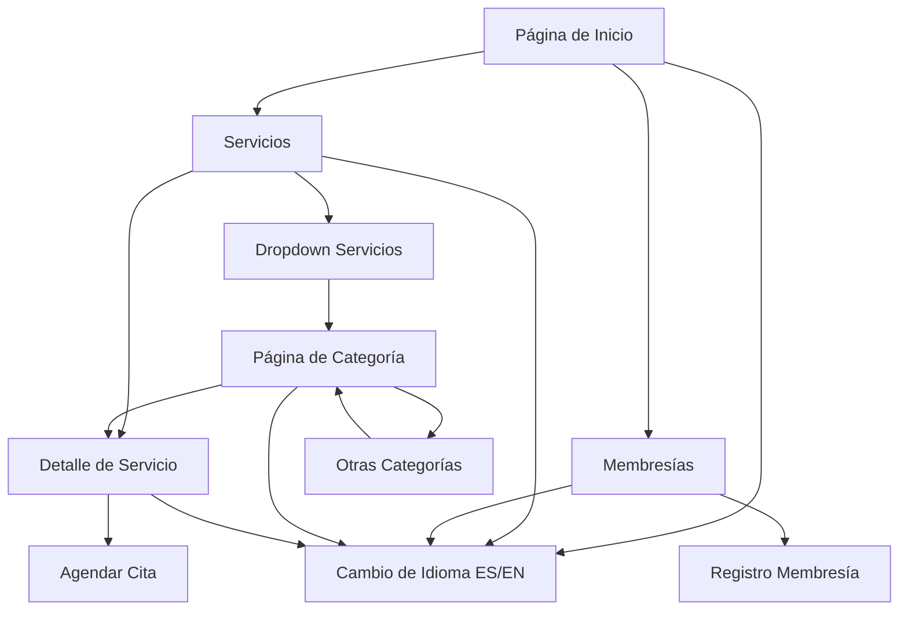

# Documento de Requerimientos del Producto - Renasci Medical Spa

## 1. Descripción General del Producto

Sitio web bilingüe (ES/EN) para Renasci Medical Spa que ofrece servicios estéticos y de bienestar médico con un diseño limpio, moderno y lujoso. La plataforma permite a los usuarios explorar servicios, agendar citas y acceder a planes de membresía exclusivos.

- **Propósito principal**: Conectar pacientes con servicios de medicina estética de alta calidad, facilitando la reserva de citas y proporcionando información detallada sobre tratamientos.
- **Usuarios objetivo**: Personas interesadas en tratamientos estéticos, rejuvenecimiento y bienestar, principalmente de 25-55 años.
- **Valor de mercado**: Posicionamiento como spa médico premium con tecnología avanzada y experiencia personalizada.

## 2. Características Principales

### 2.1 Roles de Usuario

| Rol | Método de Registro | Permisos Principales |
|-----|-------------------|---------------------|
| Visitante | No requiere registro | Navegar servicios, ver precios, cambiar idioma |
| Cliente Potencial | Formulario de contacto | Agendar consultas, recibir información |
| Miembro | Registro con email/teléfono | Acceso a precios preferenciales, historial de citas |

### 2.2 Módulo de Características

Nuestros requerimientos del sitio web de Renasci Medical Spa consisten en las siguientes páginas principales:

1. **Página de Inicio**: sección hero, navegación principal, catálogo de servicios destacados, galería antes/después, sección de membresías, testimonios.
2. **Página de Servicios**: filtros por categoría, grid de servicios, búsqueda, información de precios.
3. **Páginas de Categorías de Servicios**: páginas individuales para cada una de las 9 categorías, mostrando todos los servicios de esa categoría específica.
4. **Página de Detalle de Servicio**: descripción completa, beneficios, proceso, precios, botón de reserva, servicios relacionados.
5. **Página de Membresías**: comparación de planes (Rack, Glow, Elite), beneficios, precios, registro.

### 2.3 Detalles de Páginas

| Nombre de Página | Nombre del Módulo | Descripción de Características |
|------------------|-------------------|-------------------------------|
| Página de Inicio | Sección Hero | Mostrar mensaje principal "Renueva tu piel / Renew your glow" con botones CTA "Agendar ahora / Book now" |
| Página de Inicio | Catálogo de Servicios | Mostrar 6-8 servicios destacados con hover zoom + shadow-card, navegación a página completa |
| Página de Inicio | Galería Antes/Después | Slider interactivo con casos de éxito, optimizado para móvil y desktop |
| Página de Inicio | Sección Membresías | Preview de 3 planes con TierCard (Glow destacado con scale-105 + border-primary) |
| Página de Servicios | Sistema de Filtros | Filtrar por 9 categorías: Inyecciones, Contorno, Sculptra, Especializados, Peso, Cabello, Íntimo, Faciales, Avanzados |
| Página de Servicios | Grid de Servicios | Mostrar ServiceCard con título, descripción breve, precio, botón "Ver más" |
| Página de Servicios | Dropdown Mejorado | Mega menú con flecha visual, máximo 3 servicios por categoría + botón "Ver más", enlaces a páginas de categorías |
| Páginas de Categorías | Header de Categoría | Título de categoría, descripción, breadcrumbs, contador de servicios |
| Páginas de Categorías | Grid Completo | Mostrar todos los servicios de la categoría con ServiceCard expandido, filtros secundarios |
| Páginas de Categorías | Navegación Entre Categorías | Enlaces a categorías relacionadas, botón "Ver todas las categorías" |
| Detalle de Servicio | Información Completa | Descripción detallada, beneficios, proceso paso a paso, duración, cuidados post-tratamiento |
| Detalle de Servicio | Reserva Directa | Botón prominente "Agendar ahora" con integración a sistema de citas |
| Página de Membresías | Comparación de Planes | Tabla comparativa Rack/Glow/Elite con precios, beneficios, descuentos |
| Página de Membresías | Registro de Membresía | Formulario de registro con validación, métodos de pago, términos y condiciones |
| Navegación Global | HeaderNav | Logo centrado, menú izquierda (Inicio, Servicios, Membresías), botones/redes sociales derecha |
| Navegación Global | Botón Persistente | Botón "Agendar" flotante en móvil, lateral en desktop, siempre visible |

## 3. Proceso Principal

### Flujo de Usuario Regular:
1. **Descubrimiento**: Usuario llega al sitio y explora la página de inicio
2. **Exploración**: Navega por servicios usando filtros o búsqueda
3. **Selección**: Ve detalles de servicio específico
4. **Conversión**: Agenda cita o se registra para membresía
5. **Seguimiento**: Recibe confirmación y recordatorios

### Flujo de Navegación:

## 4. Diseño de Interfaz de Usuario

### 4.1 Estilo de Diseño

- **Colores primarios**: 
  - Logo: #C8A08C (nude elegante)
  - Primary: #E94594 (rosa CTA vibrante)
  - Soft: #FFF8F6 (fondo cálido)
- **Colores secundarios**:
  - Dark: #1A1A1A (textos principales)
  - Gray: #5E5E5E (textos secundarios)
  - White: #FFFFFF (fondos limpios)
- **Tipografía**: 
  - Títulos: Poppins SemiBold (600)
  - Párrafos: DM Sans Regular (400)
  - Tamaños: h1(48px), h2(36px), h3(24px), p(16px)
- **Estilo de botones**: Redondeados (rounded-full), gradientes suaves, hover con scale-105
- **Layout**: Diseño basado en cards, navegación superior sticky, espaciado generoso
- **Iconos**: Estilo minimalista, líneas finas, consistentes con la marca

### 4.2 Resumen de Diseño de Páginas

| Nombre de Página | Nombre del Módulo | Elementos de UI |
|------------------|-------------------|-----------------|
| Página de Inicio | Sección Hero | Fondo gradiente soft, título Poppins 48px, botones primary con hover scale-105, imagen hero optimizada WebP |
| Página de Inicio | ServiceCard | Card blanco con shadow-soft, hover zoom + shadow-card, imagen 16:9, título 20px, precio destacado |
| Página de Servicios | Filtros | Pills horizontales, active state con bg-primary, smooth transitions, responsive collapse en móvil |
| Página de Servicios | Dropdown Mejorado | Mega menú con flecha CSS apuntando al botón, ancho expandido (max-w-7xl), sombra profunda, animación suave |
| Páginas de Categorías | Header Principal | Fondo gradiente suave, título grande centrado, breadcrumbs estilo pills, descripción categoría |
| Páginas de Categorías | Grid de Servicios | Cards expandidos con más información, hover effects, botones CTA prominentes |
| Detalle de Servicio | Layout Principal | Grid 2 columnas desktop, stack móvil, galería izquierda, info derecha, sticky CTA button |
| Página de Membresías | TierCard | 3 columnas desktop, Glow destacado con border-primary + scale-105, precios grandes, lista de beneficios |
| HeaderNav | Navegación | Sticky con bg-white + shadow-card al scroll, logo centrado 120px, menú horizontal, botón CTA derecha |

### 4.3 Responsividad

- **Enfoque**: Mobile-first con breakpoints en 768px (tablet) y 1024px (desktop)
- **Interacciones táctiles**: Botones mínimo 44px, hover states adaptados para touch
- **Navegación móvil**: Menú hamburguesa, botón flotante persistente, scroll suave
- **Optimización**: Imágenes WebP/AVIF, lazy loading, preload de fuentes críticas

## 5. Contenido y Datos

### 5.1 Estructura de Servicios

**9 Categorías principales con servicios específicos del folleto Renasci:**

1. **Inyecciones y Neurotoxinas** (8 servicios)
2. **Contorno Facial y Corporal** (8 servicios) 
3. **Sculptra y Rellenos** (8 servicios)
4. **Especializados** (7 servicios)
5. **Pérdida de Peso y Bienestar** (7 servicios)
6. **Cabello y Piel** (3 servicios)
7. **Rejuvenecimiento Íntimo** (2 servicios)
8. **Faciales PRP / Células Madre** (2 servicios)
9. **Avanzados / Corporales** (1 servicio)

### 5.2 Copys Bilingües Clave

- **Hero**: "Renueva tu piel / Renew your glow"
- **Botones CTA**: "Agendar ahora / Book now" · "Ver servicios / View services"
- **Membresía**: "Únete hoy / Join today"
- **Ejemplos ServiceCard**:
  - Toxina botulínica: "Suaviza líneas de expresión / Softens expression lines"
  - Sculptra: "Activa colágeno para firmeza / Stimulates collagen for firmness"
  - PRF-Ection: "Gel PRF para regenerar / PRF gel for regeneration"

### 5.3 Planes de Membresía

| Plan | Precio | Beneficios Clave | Estado |
|------|--------|------------------|---------|
| Rack | Básico | Descuentos selectos, prioridad básica | Estándar |
| Glow | Premium | 15% descuento, prioridad alta, servicios exclusivos | **Destacado** |
| Elite | VIP | 25% descuento, acceso completo, concierge personal | Exclusivo |

## 6. Requerimientos SEO y Accesibilidad

### 6.1 SEO Técnico
- **hreflang**: Implementación ES/EN con URLs canónicas
- **Schema.org**: LocalBusiness, Service, FAQPage structured data
- **Meta tags**: Títulos únicos, descripciones optimizadas, Open Graph
- **Sitemap**: XML automático con prioridades por página

### 6.2 Accesibilidad (AA Compliance)
- **Navegación**: focus-visible, skip links, keyboard navigation
- **Contraste**: Mínimo 4.5:1 para texto, 3:1 para elementos gráficos
- **Imágenes**: Alt descriptivo, lazy loading, formatos modernos
- **Formularios**: Labels asociados, validación clara, error handling

### 6.3 Performance
- **Imágenes**: WebP/AVIF con fallbacks, responsive images
- **Fuentes**: Preload críticas (Poppins, DM Sans), font-display: swap
- **JavaScript**: Lazy loading, intersection observer para animaciones
- **Core Web Vitals**: LCP < 2.5s, FID < 100ms, CLS < 0.1