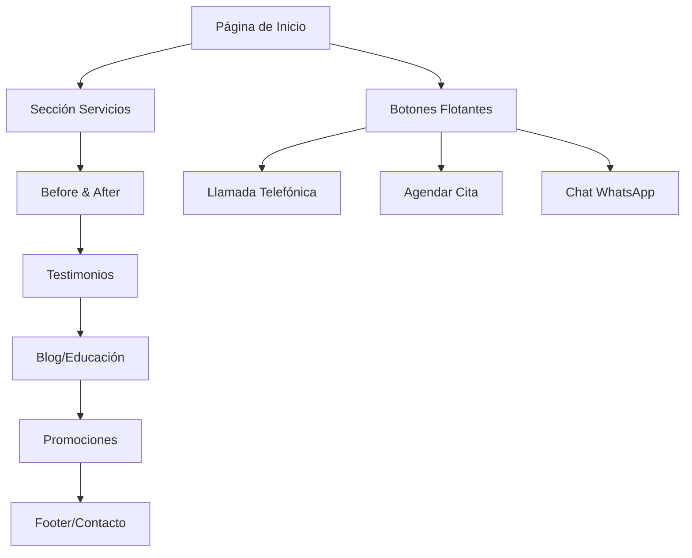

# Documentación de Requisitos - Renasci Med Spa

## 1. Descripción General del Producto

Sitio web profesional para Renasci Med Spa construido con Astro y TailwindCSS, enfocado en ofrecer una experiencia elegante y accesible para clientes que buscan servicios de medicina estética en Salt Lake City, Utah.

- **Propósito principal**: Presentar los servicios de medicina estética de Renasci Med Spa, facilitar el agendamiento de citas y establecer confianza con potenciales clientes a través de testimonios y casos de éxito.
- **Usuarios objetivo**: Personas interesadas en tratamientos de medicina estética, rejuvenecimiento facial y corporal en el área de Salt Lake City.
- **Valor de mercado**: Posicionar a Renasci como "uno de los mejores Med Spa de Salt Lake City" con enfoque en seguridad, personalización, tecnología avanzada y resultados comprobados.

## 2. Características Principales

### 2.1 Roles de Usuario

| Rol | Método de Registro | Permisos Principales |
|-----|-------------------|---------------------|
| Visitante | No requiere registro | Navegar contenido, ver servicios, contactar vía botones flotantes |
| Cliente Potencial | Formulario de contacto/cita | Agendar citas, acceder a promociones especiales |

### 2.2 Módulo de Características

Nuestros requisitos del sitio de Renasci Med Spa consisten en las siguientes páginas principales:

1. **Página de Inicio**: hero section, navegación estática, servicios destacados, testimonios, botones flotantes de acción.
2. **Sección de Servicios**: catálogo completo de tratamientos organizados por categorías con pictogramas.
3. **Galería Before & After**: slider comparativo interactivo con casos reales.
4. **Blog/Educación**: artículos informativos sobre tratamientos y cuidados.
5. **Página de Contacto**: información de ubicación, formulario de contacto y agendamiento.

### 2.3 Detalles de Páginas

| Nombre de Página | Nombre del Módulo | Descripción de Características |
|------------------|-------------------|-------------------------------|
| Página de Inicio | Hero Section | Mostrar mensaje principal "Renueva tu belleza desde adentro" con imagen de fondo cálida, sin botones CTA |
| Página de Inicio | Navbar Estático | Incluir iconos de redes sociales (izquierda), logo Renasci (centro), teléfono + botón agendar + toggle ES/EN (derecha) |
| Página de Inicio | Botones Flotantes | Tres botones fijos tipo etiqueta: teléfono (click-to-call), calendario (agendar cita), chat (WhatsApp) |
| Página de Inicio | Sección Servicios | Mostrar servicios en tarjetas con pictogramas, animaciones on-scroll, categorización clara |
| Página de Inicio | Por Qué Renasci | Destacar claim principal y pilares: seguridad, personalización, tecnología, resultados |
| Página de Inicio | Before & After | Slider comparativo con barra arrastrable para mostrar resultados |
| Página de Inicio | Testimonios | Carrusel con auto-play suave, pausa al foco, testimonios reales de clientes |
| Página de Inicio | Blog/Educación | Grid de artículos educativos sobre tratamientos y cuidados |
| Página de Inicio | Promociones | Tarjetas destacadas con ofertas especiales y paquetes |
| Página de Inicio | Footer | Tres columnas: Logo + About us, Contact us, Find us on (redes sociales) |

## 3. Proceso Principal

**Flujo del Usuario Visitante:**
1. El usuario llega a la página de inicio y ve el hero con mensaje principal
2. Navega por los servicios disponibles usando scroll o navegación
3. Revisa testimonios y casos Before & After para generar confianza
4. Utiliza los botones flotantes para contactar directamente (teléfono, WhatsApp) o agendar cita
5. Puede cambiar idioma entre español e inglés en cualquier momento
6. Accede a información de contacto y redes sociales en el footer

## 4. Diseño de Interfaz de Usuario

### 4.1 Estilo de Diseño

- **Colores primarios**: Tonos café claros (beige #F5F5DC, crema #FFFDD0, marrón claro #D2B48C)
- **Colores secundarios**: Acentos café oscuro (#8B4513, #A0522D) para contraste y elementos destacados
- **Estilo de botones**: Redondeados con elevación sutil, efecto hover con sombra difuminada
- **Tipografía**: Familias tipográficas inspiradas en beautylablaser.com (pendiente inspección CSS)
- **Tamaños de fuente**: Jerarquía clara con headings grandes y texto body legible
- **Estilo de layout**: Basado en tarjetas, navegación superior, diseño limpio y espacioso
- **Iconografía**: Pictogramas SVG de heroicons/lucide, sin emojis

### 4.2 Resumen de Diseño de Páginas

| Nombre de Página | Nombre del Módulo | Elementos UI |
|------------------|-------------------|-------------|
| Página de Inicio | Hero Section | Fondo cálido, tipografía elegante en café oscuro, layout centrado, sin botones CTA |
| Página de Inicio | Navbar | Fondo beige/crema, iconos SVG para redes sociales, logo centrado, botón "Agendar" en alto contraste |
| Página de Inicio | Botones Flotantes | Position fixed derecha, estilo etiqueta, animación slide-in, hover con elevación |
| Página de Inicio | Tarjetas de Servicios | Fondo crema, pictogramas café oscuro, animaciones on-scroll con staggering |
| Página de Inicio | Slider Before/After | Barra arrastrable interactiva, transiciones suaves, controles accesibles |
| Página de Inicio | Footer | Tres columnas equilibradas, fondo café claro, texto café oscuro, iconos de redes |

### 4.3 Responsividad

Diseño mobile-first con adaptación completa para desktop. Optimización táctil para dispositivos móviles, especialmente en botones flotantes que se vuelven colapsables/expandibles al toque. Navegación adaptativa que mantiene usabilidad en todas las resoluciones.

## 5. Requisitos Técnicos Específicos

### 5.1 Animaciones y Rendimiento
- Animaciones a 60fps usando opacity/transform (evitar top/left)
- GSAP + ScrollTrigger para animaciones on-scroll con thresholds suaves
- Motion One para microinteracciones en tarjetas y CTAs
- Parallax sutil en hero (desactivado con prefers-reduced-motion)
- Lazy loading con IntersectionObserver

### 5.2 Accesibilidad y SEO
- Contraste AA mínimo en todos los elementos
- Semántica HTML correcta con aria-labels en iconos
- Foco visible y skip to content
- Schema markup LocalBusiness/MedicalBusiness
- Meta tags OG/Twitter cards
- Keywords objetivo: "Med Spa Salt Lake City", "Botox Utah", "PRP Utah", "Rellenos", "Contorno corporal"

### 5.3 Internacionalización
- Soporte completo ES/EN con rutas /es y /en
- Toggle de idioma en navbar
- Contenido traducido en archivos JSON
- URLs amigables en ambos idiomas

### 5.4 Optimización de Rendimiento
- LCP < 2.5s en móvil
- CLS ≈ 0
- Lighthouse score ≥ 90
- Imágenes optimizadas AVIF/WebP con sizes apropiados
- Preload de fuentes críticas
- Carga selectiva por islas de Astro