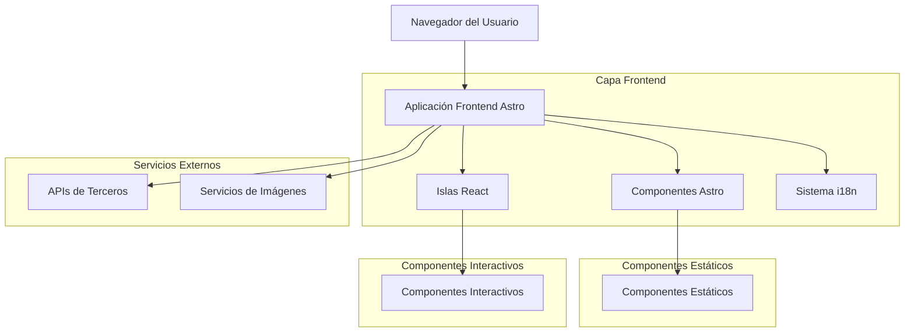
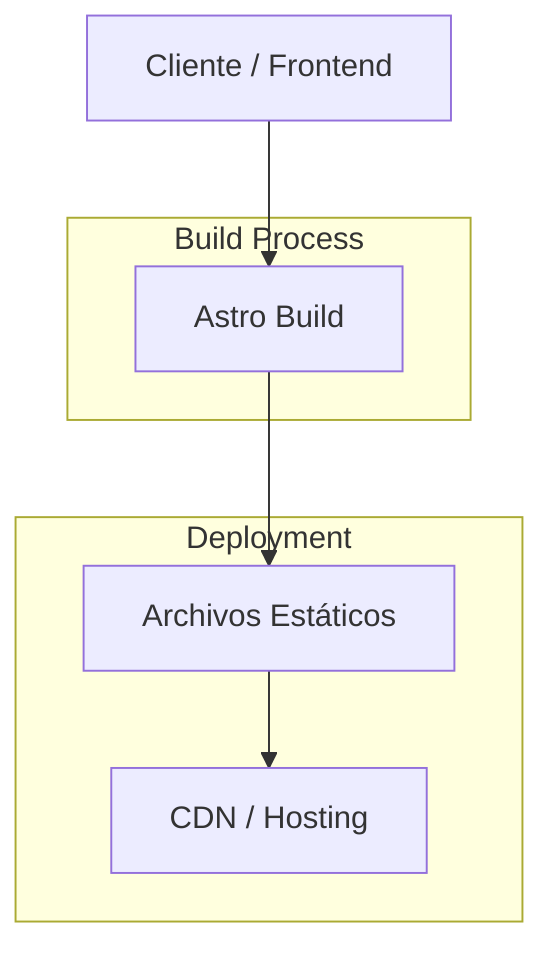
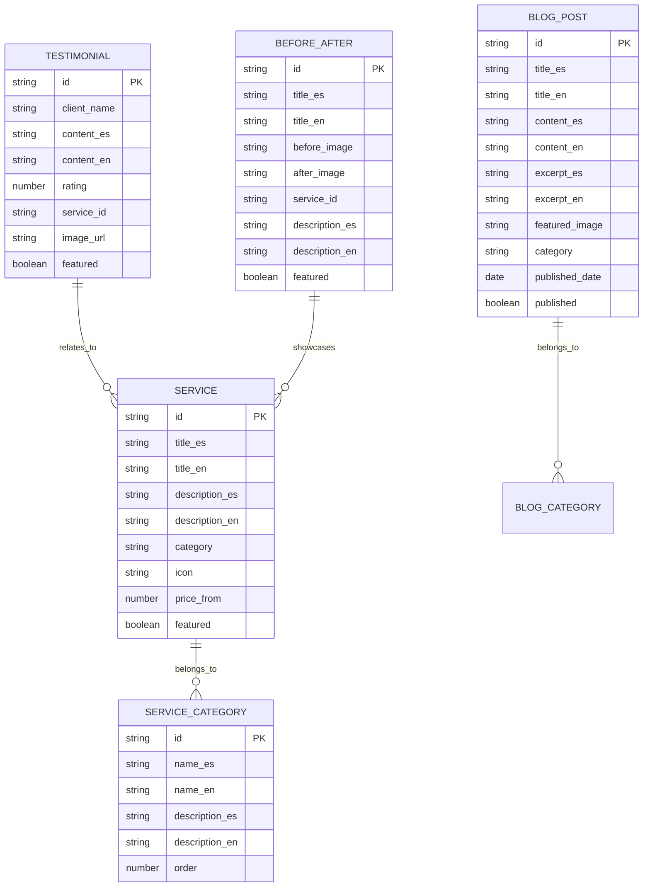

# Arquitectura Técnica - Renasci Med Spa

## 1. Diseño de Arquitectura



## 2. Descripción de Tecnologías

* **Frontend**: Astro\@5 + React\@18 + TailwindCSS\@3 + Vite

* **Animaciones**: GSAP\@3 + ScrollTrigger + Motion One + Framer Motion + Lenis

* **Internacionalización**: astro-i18next o @inlang/paraglide-astro

* **Imágenes**: @astrojs/image + astro:assets

* **Estilos**: @tailwindcss/typography + @tailwindcss/forms

* **Iconografía**: heroicons + lucide-react

* **Backend**: Ninguno (sitio estático)

## 3. Definiciones de Rutas

| Ruta          | Propósito                                        |
| ------------- | ------------------------------------------------ |
| /             | Página de inicio en español (idioma por defecto) |
| /en           | Página de inicio en inglés                       |
| /es           | Página de inicio en español (explícito)          |
| /es/servicios | Página de servicios detallados en español        |
| /en/services  | Página de servicios detallados en inglés         |
| /es/contacto  | Página de contacto en español                    |
| /en/contact   | Página de contacto en inglés                     |
| /es/blog      | Blog/educación en español                        |
| /en/blog      | Blog/educación en inglés                         |

## 4. Definiciones de API

### 4.1 APIs Principales

**Formulario de Contacto**

```
POST /api/contact
```

Request:

| Nombre del Parámetro | Tipo de Parámetro | Es Requerido | Descripción                 |
| -------------------- | ----------------- | ------------ | --------------------------- |
| name                 | string            | true         | Nombre completo del cliente |
| email                | string            | true         | Correo electrónico          |
| phone                | string            | true         | Número de teléfono          |
| service              | string            | false        | Servicio de interés         |
| message              | string            | true         | Mensaje o consulta          |
| language             | string            | true         | Idioma preferido (es/en)    |

Response:

| Nombre del Parámetro | Tipo de Parámetro | Descripción             |
| -------------------- | ----------------- | ----------------------- |
| success              | boolean           | Estado de la respuesta  |
| message              | string            | Mensaje de confirmación |

Ejemplo:

```json
{
  "name": "María González",
  "email": "maria@example.com",
  "phone": "+1-801-555-0123",
  "service": "Botox",
  "message": "Estoy interesada en una consulta para tratamiento de Botox",
  "language": "es"
}
```

**Agendamiento de Citas**

```
POST /api/appointment
```

Request:

| Nombre del Parámetro | Tipo de Parámetro | Es Requerido | Descripción                  |
| -------------------- | ----------------- | ------------ | ---------------------------- |
| name                 | string            | true         | Nombre completo              |
| email                | string            | true         | Correo electrónico           |
| phone                | string            | true         | Teléfono de contacto         |
| service              | string            | true         | Servicio solicitado          |
| preferredDate        | string            | true         | Fecha preferida (ISO format) |
| preferredTime        | string            | true         | Hora preferida               |
| notes                | string            | false        | Notas adicionales            |

Response:

| Nombre del Parámetro | Tipo de Parámetro | Descripción             |
| -------------------- | ----------------- | ----------------------- |
| success              | boolean           | Estado de la solicitud  |
| appointmentId        | string            | ID de la cita generada  |
| confirmationMessage  | string            | Mensaje de confirmación |

## 5. Arquitectura del Servidor



## 6. Modelo de Datos

### 6.1 Definición del Modelo de Datos



### 6.2 Lenguaje de Definición de Datos

**Estructura de Servicios (JSON)**

```json
{
  "services": [
    {
      "id": "botox-facial",
      "category": "facial-treatments",
      "title": {
        "es": "Botox Facial",
        "en": "Facial Botox"
      },
      "description": {
        "es": "Tratamiento de toxina botulínica para reducir arrugas de expresión",
        "en": "Botulinum toxin treatment to reduce expression wrinkles"
      },
      "icon": "face-smile",
      "priceFrom": 300,
      "featured": true
    }
  ]
}
```

**Estructura de Testimonios (JSON)**

```json
{
  "testimonials": [
    {
      "id": "testimonial-1",
      "clientName": "Sarah M.",
      "content": {
        "es": "Excelente atención y resultados increíbles. El equipo de Renasci es muy profesional.",
        "en": "Excellent service and incredible results. The Renasci team is very professional."
      },
      "rating": 5,
      "serviceId": "botox-facial",
      "imageUrl": "/images/testimonials/sarah-m.jpg",
      "featured": true
    }
  ]
}
```

**Estructura de Contenido Before & After (JSON)**

```json
{
  "beforeAfter": [
    {
      "id": "ba-botox-1",
      "title": {
        "es": "Botox - Reducción de Arrugas",
        "en": "Botox - Wrinkle Reduction"
      },
      "beforeImage": "/images/before-after/botox-before-1.jpg",
      "afterImage": "/images/before-after/botox-after-1.jpg",
      "serviceId": "botox-facial",
      "description": {
        "es": "Resultado después de 2 semanas del tratamiento",
        "en": "Result after 2 weeks of treatment"
      },
      "featured": true
    }
  ]
}
```

**Configuración de Internacionalización**

```json
{
  "es": {
    "nav": {
      "home": "Inicio",
      "services": "Servicios",
      "about": "Nosotros",
      "contact": "Contacto",
      "book": "Agendar Cita"
    },
    "hero": {
      "title": "Renueva tu belleza desde adentro",
      "subtitle": "Tratamientos de medicina estética con tecnología avanzada"
    },
    "floating": {
      "phone": "Llamar",
      "appointment": "Agendar",
      "chat": "Chat"
    }
  },
  "en": {
    "nav": {
      "home": "Home",
      "services": "Services",
      "about": "About",
      "contact": "Contact",
      "book": "Book Appointment"
    },
    "hero": {
      "title": "Renew your beauty from within",
      "subtitle": "Aesthetic medicine treatments with advanced technology"
    },
    "floating": {
      "phone": "Call",
      "appointment": "Book",
      "chat": "Chat"
    }
  }
}
```

## 7. Estructura de Archivos del Proyecto

```
/src
  /components
    Nav.astro                 # Navegación estática
    FloatingTags.jsx          # 3 botones flotantes (React)
    ServiceCard.astro         # Tarjeta de servicio individual
    BeforeAfter.jsx           # Slider comparativo (React)
    Testimonials.jsx          # Carrusel de testimonios (React)
    Footer.astro              # Footer con 3 columnas
    Hero.astro                # Sección hero principal
    ServiceGrid.astro         # Grid de servicios
    WhyRenasci.astro         # Sección "Por qué Renasci"
    BlogGrid.astro           # Grid de artículos del blog
    PromotionsSection.astro  # Sección de promociones
  /layouts
    Base.astro               # Layout base con head, scripts
  /pages
    index.astro              # Página principal (español)
    /en
      index.astro            # Página principal (inglés)
  /i18n
    es.json                  # Traducciones español
    en.json                  # Traducciones inglés
  /data
    services.json            # Datos de servicios
    testimonials.json        # Datos de testimonios
    beforeAfter.json         # Datos before & after
  /styles
    global.css               # Estilos globales
    animations.css           # Definiciones de animaciones
```

